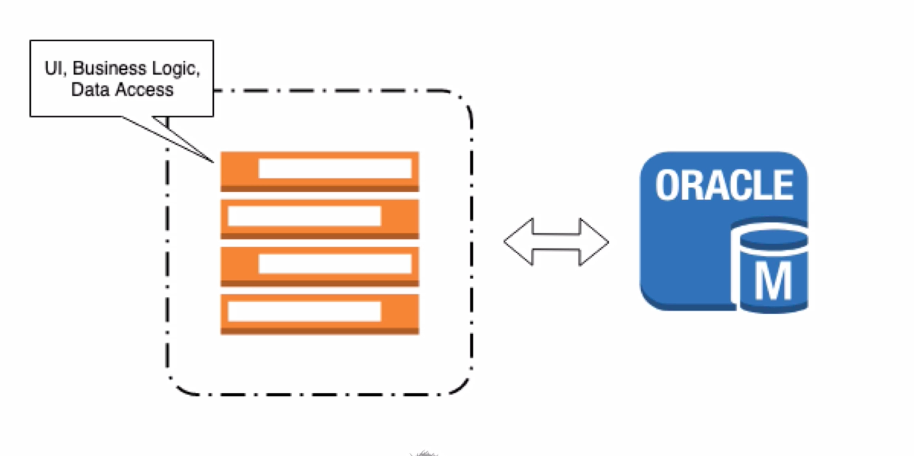

# Traditional Monolithic Architecture

* Refers to:
  * Single Application
  * One Codebase
  * One Build System
  * Single executional program (JAR/WAR)
  * In Enterprise system - An application can become VERY large
    * 10's of thousands of lines of packages, classes, methods, etc.

### Traits of Monolithic Architecture

* Code is stored together
* Typically will use one database
* Code releases are done as one big version
* Scaling is an **all or nothing** proposition
  * If one component needs to incrase scale, the whole application needs to scale

### Pros & Cons

* Pros:
  * Development is easier - everything is in one place/project
  * Deployment is easy - One app to deploy
  * Testing is simplified - One app to test
* Cons:
  * AS the business requirements of Monoliths grow, so does their complexity
  * Can lead to **anti-patterns** such as **Spaghetti Code** and **Big Ball of Mud** design patterns
  * Difficult to modify - Even the smallest change can require a full deployment
  * Technology Lock In - The monolith becomes tightly coupled to the technology stack
  * Difficult to introduce new technologies
  * CI/CD is difficult

## Microservices

## What Are Microservices?

* Microservices are small targeted services.
* Each service has its own **repository**.
* Microservices are isolated from other services.
  * Should **not** be bundleded with other services when deployed.
* Microservices are **loosely coupled**.
  * When interacting with other services, should be done in a technology agnostic way.
  * e.g. RESTful API (HTTP/JSON)

## Microservices Architecture
* With a Microservices Architecture:
  * Applications are composed using individual services
  * Each service will typicall have its own database.
  * Each microservice is independently deployable
  * Scaling of individual services is **possible**
  * CI/CD becomes easier since services are smaller and less complexity to deploy.

### Benefits of Microservices
* Easy to understand & develop - Services are smaller and more targeted
* Software Quality - Since services are more targeted and have limited scope.
* Scalability - Individual services can be scaled up/down to the application's needs
* Reliability - Software bugs are isolated to the service
* Technology Flexibility - Services can be developed using any language or tech stack.